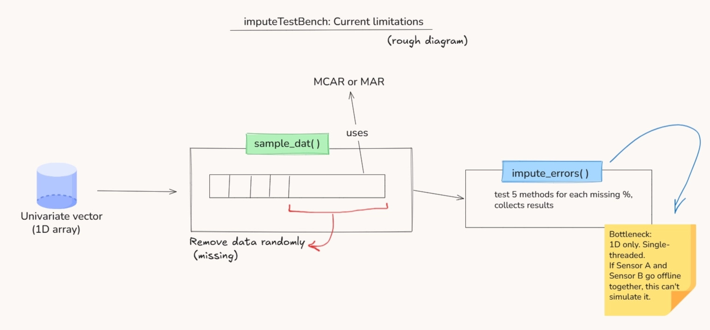
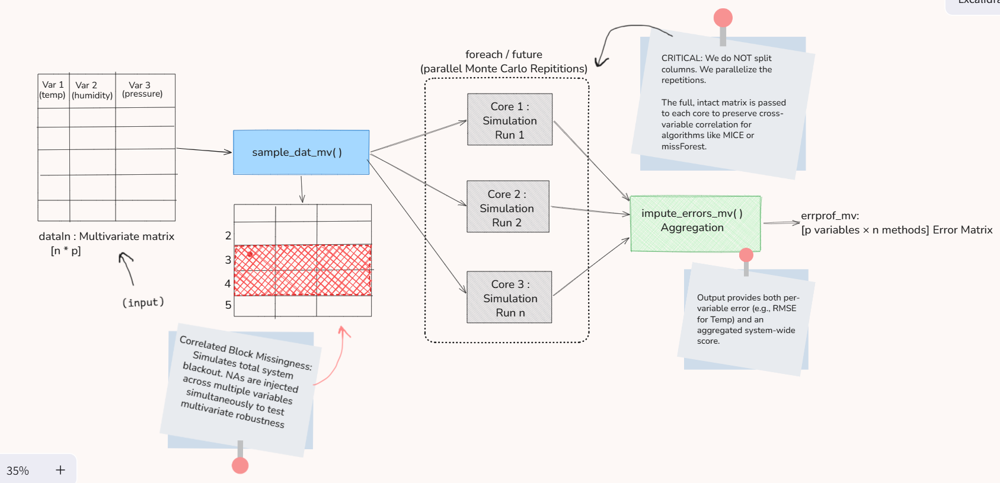

This proposal extends imputeTestbench to handle multivariate time series by introducing realistic missing data patterns that preserve variable correlations.


# 1. Why do we need Multivariate Support?

Most real-world time series data isn't just a single line of numbers. If we're monitoring a sensor hub, we aren't just tracking temperature, we're tracking humidity, pressure, and voltage all at once. 

Right now , `imputeTestbench` is great for univariate (single) time series, but it hits a wall when faced with a matrix. My goal is to bridge this gap by adding a layer that handles **multivariate datasets** and simulates **realistic sensor failures**, all while making the benchmarking process faster through parallelization.

---

# 2. Analysis of the Current Univariate Architecture

The existing pipeline is built for a single vector (1D). It’s a stable, reliable engine, but it lacks the infrastructure for multi-variable synchronization.



### Core Functions & Current Bottlenecks:
* **`sample_dat()`**: This function is designed for 1D arrays. It handles random missingness (MCAR) well, but it cannot "sync" a blackout period across multiple sensors simultaneously.
* **`impute_errors()`**: This is the evaluation engine. Because it runs on a single thread, users with large datasets are often stuck waiting for one CPU core to finish thousands of iterations.
* **Statistical Gap**: Without multivariate support, we can't test how algorithms like **MICE** or **Amelia** use the relationship *between* variables to fill in missing data.

---

# 3. The Proposed Multivariate "Wrapper" Strategy

Instead of rewriting the core package, I propose a **Wrapper Architecture** as this keeps the stable univariate code intact while adding a new layer that understands matrices and CPU threads.


Instead of independent column-wise missingness, we simulate **system-level blackouts**:
- Rows 3-4 become NAs across ALL variables (Temp, Humidity, Pressure)
- Simulates real-world scenarios: sensor failure, network outage, data loss etc. 

### Realistic "Block Missingness" generation
I plan to implement a new generator called `sample_dat_mv()`. This will simulate a "System Blackout" where multiple sensors go offline at the same time.

**Implementation Logic:**
```{r setup, message=FALSE}
# Concept for a 3-column sensor blackout logic
sample_dat_mv <- function(data_matrix, block_size = 50) {
  # Select a random starting point for the failure
  start_row <- sample(1:(nrow(data_matrix) - block_size), 1)
  
  # we'll inject NAs across ALL columns simultaneously
  # This simulates a hardware hub failure rather than random noise
  data_matrix[start_row:(start_row + block_size), ] <- NA
  
  return(data_matrix)
}
```

### Integration & Performance (backend approach)
**Hybrid Evaluation:** The new impute_errors_mv() will route data intelligently. If it’s a univariate method (like na.approx), it loops through columns. if it’s multivariate (like mice), it passes the whole matrix to keep the "cross-correlation" alive.

**Parallel Repetitions:** Benchmarking is slow because of the Monte Carlo repetitions. I’ll use the foreach and future packages to run different simulation runs on different CPU cores. this keeps the matrix intact while cutting runtime by 60-70%. 
We can make parallelization optional too, if parallel then -> foreach/future else -> simple loop

**Matrix Error Profiles:** I will expand the error functions to return a [p variables x n methods] matrix so this lets users see exactly which sensor a specific algorithm is struggling with.

---

# 4. Backward Compatibility

**Existing users:** Nothing changes. `impute_errors()` works exactly as before.

**New users:** Can use `impute_errors_mv()` for matrices.

**Future migration:** Eventually, `impute_errors()` could detect input type and route automatically:
```r
impute_errors <- function(data, ...) {
  if (is.vector(data) || is.ts(data)) {
    return(impute_errors_univariate(data, ...))
  } else {
    return(impute_errors_mv(data, ...))
  }
}
```
---

I have already mapped out the specific file level changes & internal directory logic (sample_dat_mv.R, impute_errors_mv.R) in my personal workspace. To keep this proposal focused on the architecture, i’ve left those low-level details out for now, but i’d be happy to share my full implementation plan and directory mocks & plannings once i connect with the mentors.

# References & Prior Art

- **MICE package:** van Buuren & Groothuis-Oudshoorn (2011)
- **missForest:** Stekhoven & Bühlmann (2012)  
- **Amelia:** Honaker, King & Blackwell (2011)
- **imputeTS:** Moritz & Bartz-Beielstein (2017) - similar goals for time series

---